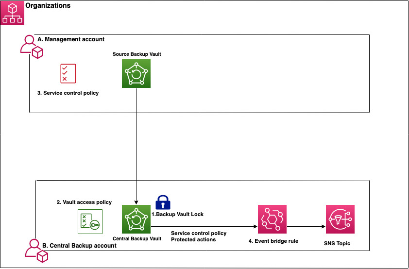

# How to Implement a Virtual Air Gap Solution with AWS Backup

This solution demonstrates how you can utilize the AWS CloudFormation automate to build the Virtual Air Gap solution with AWS Backup. Using this solution you can achieve Write Once Read Many (WORM) for your data backup stored in AWS Backup and also protect data backup from Unauthorized access other than the admin of the Central backup account vault. 

## Solution architecture and design

## 

The workflow and architecture of the solution works as follows:

In the management account (the environment hosting your AWS Organizations):

1. Opt in to use the AWS Backup service and cross-account management features. See the blog post on how to [Automate centralized backup at scale across AWS services using AWS Backup](https://aws.amazon.com/blogs/storage/automate-centralized-backup-at-scale-across-aws-services-using-aws-backup/) for further details.
2. [aws-backup-central-backup-account.yaml](./CloudFormation/aws-backup-central-backup-account.yaml): This stackset deploys the Central backup vault with vault access policy and vault lock configuration. 
3. [aws-eventrule-central-account.yaml](./CloudFormation/aws-eventrule-central-account.yaml):This stackset deploys the Event bridge notification rule, SNS topic for notification to notify when any mutative or management operations are performed on the Central Backup Vault by anyone other than the authorized admin of the account. 
4. [aws-scp-management-account.yaml](./CloudFormation/aws-scp-management-account.yaml): This stack deploys the Lambda function which creates service control policy which restricts mutative or management operations that are performed on the Central Backup Vault by anyone other than the authorized admin of the account.

## Security

See [CONTRIBUTING](CONTRIBUTING.md#security-issue-notifications) for more information.

## License

This library is licensed under the MIT-0 License. See the LICENSE file.